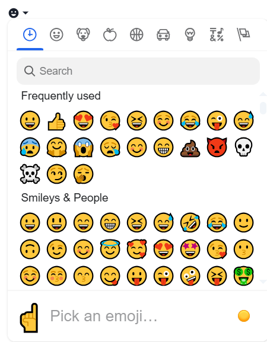

# Overview

The emoji picker component provided by the emoji-mart library will enable users to efficiently browse, search, and select emojis from a comprehensive library, enhancing user interactions and making content more expressive and engaging.

## Emoji picker component:

## Datasource

| Name        | Type   | Required | Description                      |
| ----------- | ------ | -------- | -------------------------------- |
| Qodlysource | String | Yes      | Will contain the selected emoji. |

## Properties

| Name         | Type   | Default value | Description                                   |
| ------------ | ------ | ------------- | --------------------------------------------- |
| Theme        | String | Light         | Will set the theme of the emoji picker        |
| Nav position | String | Top           | Will set the position of the emoji nav picker |
